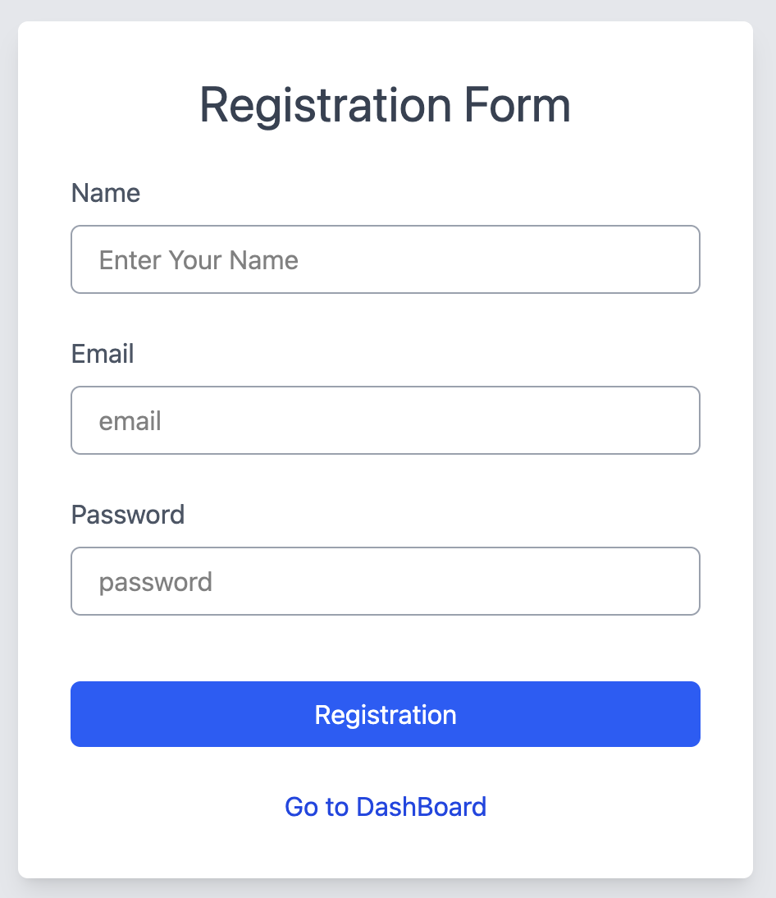
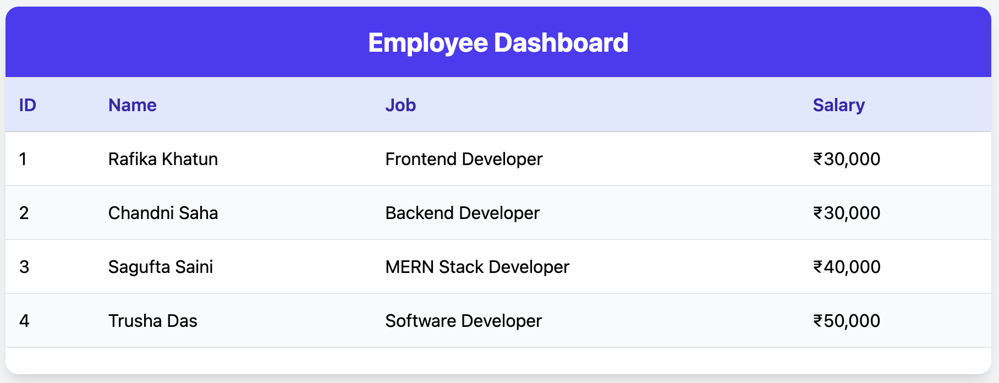

# 📝 React Registration & Dashboard App

This is a simple React-based web application that allows users to register using a form and then view a static dashboard. It uses `react-router-dom` for navigation and `fetch()` for submitting form data to a backend API.

---

## 🚀 Features

✅ Registration Form  
✅ Form Submission with `fetch()` (POST request)  
✅ Tailwind CSS styling  
✅ Dashboard with a static employee table  
✅ Smooth navigation using React Router DOM

---

## 🖼️ Screenshots

### 🔐 Registration Page

### 📊 Dashboard Page

---

## 🔧 Tech Stack

- **React.js**
- **React Router DOM**
- **Tailwind CSS**
- **JavaScript (ES6+)**
- **Fake/Local API (e.g., localhost:5050)**

---

## 📁 Project Structure

